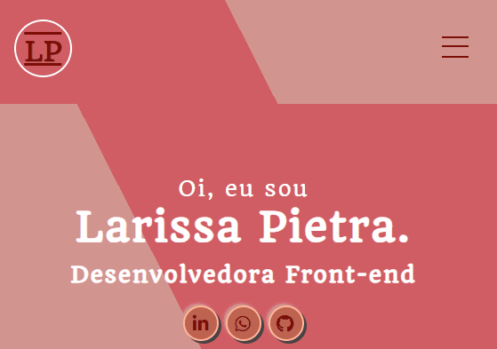

# Portfólio 👩🏽‍💻
Meu portfólio, criado para mostrar meus projetos e futuros projetos que estou desenvolvendo. 🚀
[]
Foi bem desafiador e divertido de fazer esse projeto, participei de um desafio onde eu teria que criar meu portfólio apenas com HTML e CSS, então deu pra brincar um pouco com as estilizações, fui testando cores e efeitos que combinassem e que ao mesmo tempo tivessem minha cara.

## Tecnologias utilizadas
- HTML
- CSS

## Dificuldades que tive
O mais difícil nesse projeto foi não usar nenhuma outra tecnologia, já que a proposta do desafio era usar apenas HTML e CSS. Isso me limitou um pouco mas também me abriu os olhos para uma outra coisa... ⬇️

## Coisas que aprendi 
Dessa forma pude explorar várias possibilidades no css, como por exemplo o "menu-hambúrguer", sem precisar usar nenhuma outra tecnologia. E pude também me divertir enquanto criava esse projeto, testando cores, sombras, estilos e tudo mais.

[]
 